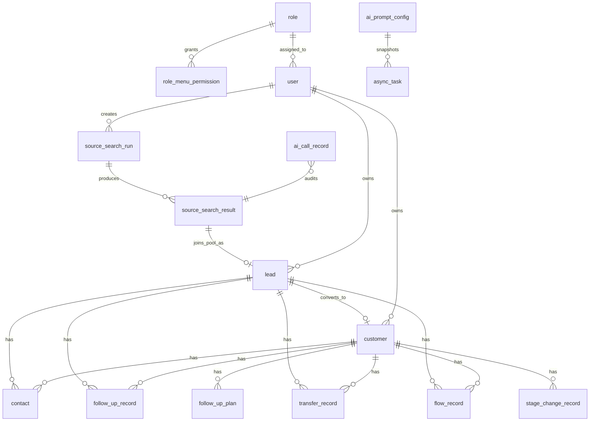

# AIcrm V1.10 数据库表结构文档

更新时间：2026-05-15  
适用范围：`E:\Desktop\git\LZcrm\sql` 当前 schema、migration 和 WeKnora 本地隔离脚本  
数据库：PostgreSQL  
主 schema：`public`  
知识库 schema：`weknora`

本文档给研发查看当前数据库结构。字段以 `sql/init/001_p0_schema.sql` 为主，`sql/migrations/20260512_aicrm_v110_full.sql` 实际引用该完整 schema；WeKnora 相关隔离以 `sql/weknora/001_local_weknora_schema.sql` 和 `sql/migrations/20260515_aicrm_weknora_knowledge_base_settings.sql` 为准。

## 1. 全局约定

- 表名和字段名统一使用 `snake_case`。
- 业务表默认在 `public` schema。
- WeKnora 独立知识库表放在 `weknora` schema，AIcrm 只通过同一个 PostgreSQL database 中的 schema 边界读取 Top K 知识片段。
- 当前项目基本不使用数据库外键，关联关系由应用层按 ID 保证。
- 绝大多数业务表使用逻辑删除字段 `is_deleted`。
- 状态值使用字符串字段，不使用数据库 enum。
- JSON/动态结构使用 `JSONB`，主要用于标签、原始 POI、AI 输入输出快照、知识片段和扩展字段。
- 时间字段存在两套历史命名：早期表多用 `create_time/update_time`，V1.10 新表多用 `created_at/updated_at`。
- `"user"` 是 PostgreSQL 保留相关名称，SQL 中需要带双引号。

## 2. 表清单

| 表名 | 模块 | 主键 | 用途 |
| --- | --- | --- | --- |
| `role` | 认证权限 | `id` | 角色主表 |
| `role_menu_permission` | 认证权限 | `id` | 角色菜单权限 |
| `"user"` | 认证权限 | `id` | 系统用户 |
| `sms_verification_code` | 认证权限 | `sms_verification_code_id` | 短信验证码 |
| `dictionary_item` | 设置 | `id` | 数据字典 |
| `system_setting` | 设置 | `id` | 系统设置和第三方 key |
| `ai_prompt_config` | AI驾驶舱 | `id` | AI 提示词配置 |
| `ai_call_record` | AI驾驶舱 | `ai_call_id` | AI 调用审计记录 |
| `async_task` | 运行时 | `id` | 异步任务状态和快照 |
| `search_task` | 旧线索挖掘 | `id` | 兼容旧版检索任务 |
| `search_result` | 旧线索挖掘 | `id` | 兼容旧版检索结果 |
| `source_search_run` | V1.10 线索挖掘 | `source_search_run_id` | 高德线索挖掘任务 |
| `source_search_result` | V1.10 线索挖掘 | `source_result_id` | 高德 POI 结果和 AI 补全结果 |
| `lead` | 线索 | `id` | 线索主表和线索公海 |
| `customer` | 客户 | `id` | 客户主表和客户公海 |
| `contact` | 联系人 | `id` | 线索/客户联系人 |
| `follow_up_plan` | 跟进 | `id` | 跟进计划 |
| `follow_up_record` | 跟进 | `id` | 跟进记录 |
| `transfer_record` | 流转 | `id` | 负责人转移记录 |
| `flow_record` | 流转 | `id` | 公海/私海流转记录 |
| `stage_change_record` | 客户阶段 | `id` | 客户阶段变更记录 |
| `notification` | 通知 | `notification_id` | 用户通知 |

## 3. 核心关系



说明：

- `contact`、`follow_up_plan`、`follow_up_record`、`transfer_record`、`flow_record` 使用 `resource_type + resource_id` 做多态关联，可挂在线索或客户上。
- `source_search_result -> lead -> customer` 是 V1.10 主业务链路。
- `search_task/search_result` 是旧版兼容链路，V1.10 页面优先使用 `source_search_run/source_search_result`。
- RAG 痛点总结的知识片段不单独建 AIcrm 业务表，审计进入 `ai_call_record.ai_input.knowledge_chunks`。

## 4. 表结构明细

### 4.1 `role`

用途：角色主表。

```sql
id BIGSERIAL PRIMARY KEY
name VARCHAR(128) NOT NULL
is_default BOOLEAN NOT NULL DEFAULT FALSE
create_time TIMESTAMPTZ NOT NULL DEFAULT NOW()
update_time TIMESTAMPTZ NOT NULL DEFAULT NOW()
is_deleted BOOLEAN NOT NULL DEFAULT FALSE
```

索引：

```sql
idx_role_name_active ON role (name) WHERE is_deleted = FALSE
```

### 4.2 `role_menu_permission`

用途：角色可访问菜单路径，当前粒度到页面/菜单路径。

```sql
id BIGSERIAL PRIMARY KEY
role_id BIGINT NOT NULL
menu_path VARCHAR(255) NOT NULL
create_time TIMESTAMPTZ NOT NULL DEFAULT NOW()
update_time TIMESTAMPTZ NOT NULL DEFAULT NOW()
is_deleted BOOLEAN NOT NULL DEFAULT FALSE
```

索引：

```sql
idx_role_menu_permission_active ON role_menu_permission (role_id, menu_path) WHERE is_deleted = FALSE
```

### 4.3 `"user"`

用途：系统用户主表。

```sql
id BIGSERIAL PRIMARY KEY
username VARCHAR(64) NOT NULL
password_hash VARCHAR(255) NOT NULL
display_name VARCHAR(128) NOT NULL
user_status VARCHAR(32) NOT NULL DEFAULT 'enabled'
mobile VARCHAR(32) NOT NULL DEFAULT ''
role_id BIGINT NOT NULL DEFAULT 0
is_default BOOLEAN NOT NULL DEFAULT FALSE
create_time TIMESTAMPTZ NOT NULL DEFAULT NOW()
update_time TIMESTAMPTZ NOT NULL DEFAULT NOW()
is_deleted BOOLEAN NOT NULL DEFAULT FALSE
```

说明：`password_hash` 存 bcrypt 哈希；默认用户通过 `is_default` 控制，不允许删除。

索引：

```sql
idx_user_username_active ON "user" (username) WHERE is_deleted = FALSE
idx_user_mobile_active ON "user" (mobile) WHERE is_deleted = FALSE AND mobile <> ''
```

### 4.4 `sms_verification_code`

用途：短信验证码登录。

```sql
sms_verification_code_id BIGSERIAL PRIMARY KEY
mobile VARCHAR(32) NOT NULL DEFAULT ''
verification_code_hash VARCHAR(255) NOT NULL DEFAULT ''
expires_at TIMESTAMPTZ NOT NULL
error_count INTEGER NOT NULL DEFAULT 0
max_error_count INTEGER NOT NULL DEFAULT 5
resend_available_at TIMESTAMPTZ NOT NULL
consumed_at TIMESTAMPTZ NULL
created_at TIMESTAMPTZ NOT NULL DEFAULT NOW()
is_deleted BOOLEAN NOT NULL DEFAULT FALSE
```

索引：

```sql
idx_sms_verification_mobile_created ON sms_verification_code (mobile, created_at DESC) WHERE is_deleted = FALSE
```

### 4.5 `dictionary_item`

用途：数据字典。区域、细分行业、状态显示值、跟进方式等均从这里取。

```sql
id BIGSERIAL PRIMARY KEY
dict_type VARCHAR(64) NOT NULL
dict_code VARCHAR(64) NOT NULL
dict_name VARCHAR(128) NOT NULL
description TEXT NOT NULL DEFAULT ''
sort_no INTEGER NOT NULL DEFAULT 0
enabled BOOLEAN NOT NULL DEFAULT TRUE
create_time TIMESTAMPTZ NOT NULL DEFAULT NOW()
update_time TIMESTAMPTZ NOT NULL DEFAULT NOW()
is_deleted BOOLEAN NOT NULL DEFAULT FALSE
```

关键字典：

| dict_type | 用途 |
| --- | --- |
| `city_adcode` | 高德地区编码，线索挖掘 `area_code` 来源 |
| `sub_industry` | 细分行业，线索挖掘 `sub_industry_id` 来源；`description` 存搜索关键词 JSON |
| `customer_stage_display` | 客户阶段展示 |
| `customer_status` | 客户状态 |
| `lead_status` | 线索状态 |
| `follow_up_method` | 跟进方式 |

索引：

```sql
idx_dictionary_item_active ON dictionary_item (dict_type, dict_code) WHERE is_deleted = FALSE
```

### 4.6 `system_setting`

用途：系统配置、第三方 key、RAG 参数。

```sql
id BIGSERIAL PRIMARY KEY
setting_key VARCHAR(64) NOT NULL
setting_name VARCHAR(128) NOT NULL
setting_value VARCHAR(255) NOT NULL
description TEXT NOT NULL DEFAULT ''
create_time TIMESTAMPTZ NOT NULL DEFAULT NOW()
update_time TIMESTAMPTZ NOT NULL DEFAULT NOW()
is_deleted BOOLEAN NOT NULL DEFAULT FALSE
```

关键配置：

| setting_key | 用途 |
| --- | --- |
| `amap_api_key` | 高德 POI 检索 |
| `weknora_admin_url` | 知识库后台入口地址 |
| `weknora_pg_schema` | WeKnora schema，默认 `weknora` |
| `weknora_knowledge_base_ids` | RAG 检索知识库 ID |
| `rag_top_k` | RAG Top K |
| `rag_timeout_seconds` | RAG 超时秒数 |
| `ai_gateway_base_url` | AI 中转站 base URL |
| `ai_gateway_api_key` | AI 中转站 key |
| `chat_model_name` | 对话模型 |
| `embedding_model_name` | embedding 模型 |
| `embedding_dimension` | 向量维度 |

索引：

```sql
idx_system_setting_key_active ON system_setting (setting_key) WHERE is_deleted = FALSE
```

### 4.7 `ai_prompt_config`

用途：AI驾驶舱提示词配置。

```sql
id BIGSERIAL PRIMARY KEY
prompt_key VARCHAR(128) NOT NULL
prompt_name VARCHAR(255) NOT NULL
prompt_group VARCHAR(64) NOT NULL
prompt_content TEXT NOT NULL
is_enabled BOOLEAN NOT NULL DEFAULT TRUE
version INTEGER NOT NULL DEFAULT 1
remark TEXT NOT NULL DEFAULT ''
update_user_id BIGINT NOT NULL DEFAULT 0
create_time TIMESTAMPTZ NOT NULL DEFAULT NOW()
update_time TIMESTAMPTZ NOT NULL DEFAULT NOW()
is_deleted BOOLEAN NOT NULL DEFAULT FALSE
```

索引：

```sql
idx_ai_prompt_config_key_active ON ai_prompt_config (prompt_key) WHERE is_deleted = FALSE
```

### 4.8 `ai_call_record`

用途：AI 调用审计。RAG 痛点总结会把知识片段、模型输入、输出和失败原因落这里。

```sql
ai_call_id BIGSERIAL PRIMARY KEY
capability VARCHAR(128) NOT NULL DEFAULT ''
resource_type VARCHAR(32) NOT NULL DEFAULT ''
resource_id BIGINT NOT NULL DEFAULT 0
ai_input JSONB NOT NULL DEFAULT '{}'::jsonb
ai_output JSONB NOT NULL DEFAULT '{}'::jsonb
generated_at TIMESTAMPTZ NOT NULL DEFAULT NOW()
model_name VARCHAR(128) NOT NULL DEFAULT ''
is_used BOOLEAN NOT NULL DEFAULT FALSE
is_edited BOOLEAN NOT NULL DEFAULT FALSE
ai_failure_reason JSONB NOT NULL DEFAULT '{}'::jsonb
created_by BIGINT NOT NULL DEFAULT 0
is_deleted BOOLEAN NOT NULL DEFAULT FALSE
```

索引：

```sql
idx_ai_call_record_resource_created ON ai_call_record (resource_type, resource_id, generated_at DESC) WHERE is_deleted = FALSE
```

### 4.9 `async_task`

用途：异步任务统一状态表，支撑线索补充、话术生成、跟进总结、客户阶段判断等。

```sql
id BIGSERIAL PRIMARY KEY
task_type VARCHAR(64) NOT NULL
resource_type VARCHAR(32) NOT NULL
resource_id BIGINT NOT NULL DEFAULT 0
task_status VARCHAR(32) NOT NULL
prompt_key VARCHAR(128) NOT NULL DEFAULT ''
prompt_snapshot TEXT NOT NULL DEFAULT ''
business_payload_snapshot JSONB NOT NULL DEFAULT '{}'::jsonb
context_snapshot JSONB NOT NULL DEFAULT '{}'::jsonb
input_payload JSONB NOT NULL DEFAULT '{}'::jsonb
output_payload JSONB NOT NULL DEFAULT '{}'::jsonb
error_message TEXT NOT NULL DEFAULT ''
create_time TIMESTAMPTZ NOT NULL DEFAULT NOW()
update_time TIMESTAMPTZ NOT NULL DEFAULT NOW()
is_deleted BOOLEAN NOT NULL DEFAULT FALSE
```

状态建议：`pending`、`running`、`success`、`failed`。

### 4.10 `search_task`

用途：旧版线索挖掘任务，V1.10 保留兼容。

```sql
id BIGSERIAL PRIMARY KEY
template_code VARCHAR(64) NOT NULL
task_status VARCHAR(32) NOT NULL
keyword VARCHAR(128) NOT NULL
city_code VARCHAR(32) NOT NULL
district_code VARCHAR(64) NOT NULL DEFAULT ''
store_category VARCHAR(64) NOT NULL DEFAULT ''
price_band VARCHAR(64) NOT NULL DEFAULT ''
store_type VARCHAR(64) NOT NULL DEFAULT ''
scale_type VARCHAR(64) NOT NULL DEFAULT ''
mobile_required VARCHAR(64) NOT NULL DEFAULT ''
business_stage VARCHAR(64) NOT NULL DEFAULT ''
operation_signal VARCHAR(64) NOT NULL DEFAULT ''
group_buy_status VARCHAR(64) NOT NULL DEFAULT ''
group_buy_package_count VARCHAR(64) NOT NULL DEFAULT ''
rating_level VARCHAR(64) NOT NULL DEFAULT ''
opportunity_level VARCHAR(64) NOT NULL DEFAULT ''
pain_point VARCHAR(64) NOT NULL DEFAULT ''
team_size VARCHAR(64) NOT NULL DEFAULT ''
owner_id BIGINT NOT NULL
result_count INTEGER NOT NULL DEFAULT 0
create_time TIMESTAMPTZ NOT NULL DEFAULT NOW()
update_time TIMESTAMPTZ NOT NULL DEFAULT NOW()
is_deleted BOOLEAN NOT NULL DEFAULT FALSE
```

索引：

```sql
idx_search_task_owner_status_created ON search_task (owner_id, task_status, create_time DESC)
```

### 4.11 `search_result`

用途：旧版线索挖掘结果，V1.10 保留兼容。

```sql
id BIGSERIAL PRIMARY KEY
search_task_id BIGINT NOT NULL
external_id VARCHAR(128) NOT NULL
company_name VARCHAR(256) NOT NULL
contact_name VARCHAR(128) NOT NULL DEFAULT ''
mobile VARCHAR(32) NOT NULL DEFAULT ''
address TEXT NOT NULL DEFAULT ''
result_status VARCHAR(32) NOT NULL DEFAULT 'new'
raw_payload JSONB NOT NULL DEFAULT '{}'::jsonb
create_time TIMESTAMPTZ NOT NULL DEFAULT NOW()
update_time TIMESTAMPTZ NOT NULL DEFAULT NOW()
is_deleted BOOLEAN NOT NULL DEFAULT FALSE
```

索引：

```sql
idx_search_result_external_active ON search_result (search_task_id, external_id) WHERE is_deleted = FALSE
idx_search_result_task_status_created ON search_result (search_task_id, result_status, create_time DESC)
```

### 4.12 `source_search_run`

用途：V1.10 高德线索挖掘任务。

```sql
source_search_run_id BIGSERIAL PRIMARY KEY
region_name TEXT NOT NULL DEFAULT ''
adcode VARCHAR(32) NOT NULL DEFAULT ''
sub_industry TEXT NOT NULL DEFAULT ''
search_keywords JSONB NOT NULL DEFAULT '[]'::jsonb
search_status VARCHAR(32) NOT NULL DEFAULT 'running'
raw_result_count INTEGER NOT NULL DEFAULT 0
deduped_result_count INTEGER NOT NULL DEFAULT 0
joined_pool_count INTEGER NOT NULL DEFAULT 0
failed_keywords JSONB NOT NULL DEFAULT '[]'::jsonb
search_failure_reason TEXT NOT NULL DEFAULT ''
error_detail JSONB NOT NULL DEFAULT '{}'::jsonb
created_by BIGINT NOT NULL DEFAULT 0
created_at TIMESTAMPTZ NOT NULL DEFAULT NOW()
completed_at TIMESTAMPTZ NULL
is_deleted BOOLEAN NOT NULL DEFAULT FALSE
```

状态：`running`、`success`、`partial_success`、`failed`。

索引：

```sql
idx_source_search_run_created ON source_search_run (created_by, search_status, created_at DESC) WHERE is_deleted = FALSE
```

### 4.13 `source_search_result`

用途：V1.10 高德 POI 原始结果、去重状态、AI 补全结果、RAG 痛点结果。

```sql
source_result_id BIGSERIAL PRIMARY KEY
source_search_run_id BIGINT NOT NULL DEFAULT 0
dedupe_key TEXT NOT NULL DEFAULT ''
result_status VARCHAR(32) NOT NULL DEFAULT 'not_joined_pool'
duplicate_reason TEXT NOT NULL DEFAULT ''
duplicate_object_type VARCHAR(32) NOT NULL DEFAULT ''
duplicate_object_id BIGINT NOT NULL DEFAULT 0
amap_poi_id TEXT NOT NULL DEFAULT ''
parent TEXT NOT NULL DEFAULT ''
poi_name TEXT NOT NULL DEFAULT ''
poi_type TEXT NOT NULL DEFAULT ''
poi_typecode TEXT NOT NULL DEFAULT ''
biz_type TEXT NOT NULL DEFAULT ''
poi_address TEXT NOT NULL DEFAULT ''
poi_location TEXT NOT NULL DEFAULT ''
distance TEXT NOT NULL DEFAULT ''
poi_tel_raw TEXT NOT NULL DEFAULT ''
contact_phone TEXT NOT NULL DEFAULT ''
postcode TEXT NOT NULL DEFAULT ''
website TEXT NOT NULL DEFAULT ''
email TEXT NOT NULL DEFAULT ''
pcode TEXT NOT NULL DEFAULT ''
pname TEXT NOT NULL DEFAULT ''
citycode TEXT NOT NULL DEFAULT ''
poi_cityname TEXT NOT NULL DEFAULT ''
adcode TEXT NOT NULL DEFAULT ''
poi_adname TEXT NOT NULL DEFAULT ''
entr_location TEXT NOT NULL DEFAULT ''
exit_location TEXT NOT NULL DEFAULT ''
navi_poiid TEXT NOT NULL DEFAULT ''
gridcode TEXT NOT NULL DEFAULT ''
alias TEXT NOT NULL DEFAULT ''
parking_type TEXT NOT NULL DEFAULT ''
tag TEXT NOT NULL DEFAULT ''
indoor_map TEXT NOT NULL DEFAULT ''
indoor_data JSONB NOT NULL DEFAULT '{}'::jsonb
cpid TEXT NOT NULL DEFAULT ''
floor TEXT NOT NULL DEFAULT ''
truefloor TEXT NOT NULL DEFAULT ''
groupbuy_num TEXT NOT NULL DEFAULT ''
poi_business_area TEXT NOT NULL DEFAULT ''
atag TEXT NOT NULL DEFAULT ''
discount_num TEXT NOT NULL DEFAULT ''
biz_ext JSONB NOT NULL DEFAULT '{}'::jsonb
poi_rating NUMERIC(5,2) NULL
poi_cost NUMERIC(10,2) NULL
meal_ordering TEXT NOT NULL DEFAULT ''
seat_ordering TEXT NOT NULL DEFAULT ''
ticket_ordering TEXT NOT NULL DEFAULT ''
hotel_ordering TEXT NOT NULL DEFAULT ''
poi_photos JSONB NOT NULL DEFAULT '[]'::jsonb
poi_raw JSONB NOT NULL DEFAULT '{}'::jsonb
sub_industry TEXT NOT NULL DEFAULT ''
brand_name TEXT NOT NULL DEFAULT ''
store_count INTEGER NULL
business_info TEXT NOT NULL DEFAULT ''
business_pain_points TEXT NOT NULL DEFAULT ''
ai_failure_reason JSONB NOT NULL DEFAULT '{}'::jsonb
internet_search_raw JSONB NOT NULL DEFAULT '{}'::jsonb
agent_input JSONB NOT NULL DEFAULT '{}'::jsonb
agent_output JSONB NOT NULL DEFAULT '{}'::jsonb
created_at TIMESTAMPTZ NOT NULL DEFAULT NOW()
updated_at TIMESTAMPTZ NOT NULL DEFAULT NOW()
is_deleted BOOLEAN NOT NULL DEFAULT FALSE
```

状态：`not_joined_pool`、`completion_failed`，以及后续可扩展的加入/重复状态。

索引：

```sql
idx_source_search_result_run_status ON source_search_result (source_search_run_id, result_status, created_at DESC) WHERE is_deleted = FALSE
idx_source_search_result_dedupe ON source_search_result (dedupe_key) WHERE is_deleted = FALSE AND dedupe_key <> ''
```

### 4.14 `lead`

用途：线索主表。既承载线索池归属，也冗余 V1.10 POI/经营信息，支持列表、详情、跟进、转客户。

基础字段：

```sql
id BIGSERIAL PRIMARY KEY
source_type VARCHAR(32) NOT NULL
source_search_result_id BIGINT NOT NULL DEFAULT 0
owner_id BIGINT NOT NULL
lead_status VARCHAR(32) NOT NULL
company_name VARCHAR(256) NOT NULL
contact_name VARCHAR(128) NOT NULL DEFAULT ''
mobile VARCHAR(32) NOT NULL
address TEXT NOT NULL DEFAULT ''
region_code VARCHAR(64) NOT NULL DEFAULT ''
industry_code VARCHAR(64) NOT NULL DEFAULT ''
store_category VARCHAR(64) NOT NULL DEFAULT ''
store_tags JSONB NOT NULL DEFAULT '[]'::jsonb
recommendation_reason TEXT NOT NULL DEFAULT ''
score INTEGER NOT NULL DEFAULT 0
contact_status VARCHAR(32) NOT NULL DEFAULT 'not_connected'
latest_follow_up_result VARCHAR(32) NOT NULL DEFAULT ''
enrichment_status VARCHAR(32) NOT NULL DEFAULT 'pending'
lead_enrichment_status VARCHAR(32) NOT NULL DEFAULT 'pending'
lead_script_status VARCHAR(32) NOT NULL DEFAULT 'pending'
lead_script_content TEXT NOT NULL DEFAULT ''
lead_convert_decision VARCHAR(64) NOT NULL DEFAULT 'pending'
lead_pain_summary TEXT NOT NULL DEFAULT ''
last_follow_up_time TIMESTAMPTZ NULL
next_follow_up_time TIMESTAMPTZ NULL
sea_entry_time TIMESTAMPTZ NULL
in_pool BOOLEAN NOT NULL DEFAULT FALSE
create_time TIMESTAMPTZ NOT NULL DEFAULT NOW()
update_time TIMESTAMPTZ NOT NULL DEFAULT NOW()
is_deleted BOOLEAN NOT NULL DEFAULT FALSE
```

V1.10 来源、POI、经营补充和转客户字段：

```sql
source_search_run_id BIGINT NOT NULL DEFAULT 0
source_result_id BIGINT NOT NULL DEFAULT 0
dedupe_key TEXT NOT NULL DEFAULT ''
amap_poi_id TEXT NOT NULL DEFAULT ''
parent TEXT NOT NULL DEFAULT ''
poi_name TEXT NOT NULL DEFAULT ''
poi_type TEXT NOT NULL DEFAULT ''
poi_typecode TEXT NOT NULL DEFAULT ''
biz_type TEXT NOT NULL DEFAULT ''
poi_address TEXT NOT NULL DEFAULT ''
poi_location TEXT NOT NULL DEFAULT ''
distance TEXT NOT NULL DEFAULT ''
poi_tel_raw TEXT NOT NULL DEFAULT ''
contact_phone TEXT NOT NULL DEFAULT ''
postcode TEXT NOT NULL DEFAULT ''
website TEXT NOT NULL DEFAULT ''
email TEXT NOT NULL DEFAULT ''
pcode TEXT NOT NULL DEFAULT ''
pname TEXT NOT NULL DEFAULT ''
citycode TEXT NOT NULL DEFAULT ''
poi_cityname TEXT NOT NULL DEFAULT ''
adcode TEXT NOT NULL DEFAULT ''
poi_adname TEXT NOT NULL DEFAULT ''
entr_location TEXT NOT NULL DEFAULT ''
exit_location TEXT NOT NULL DEFAULT ''
navi_poiid TEXT NOT NULL DEFAULT ''
gridcode TEXT NOT NULL DEFAULT ''
alias TEXT NOT NULL DEFAULT ''
parking_type TEXT NOT NULL DEFAULT ''
tag TEXT NOT NULL DEFAULT ''
indoor_map TEXT NOT NULL DEFAULT ''
indoor_data JSONB NOT NULL DEFAULT '{}'::jsonb
cpid TEXT NOT NULL DEFAULT ''
floor TEXT NOT NULL DEFAULT ''
truefloor TEXT NOT NULL DEFAULT ''
groupbuy_num TEXT NOT NULL DEFAULT ''
poi_business_area TEXT NOT NULL DEFAULT ''
atag TEXT NOT NULL DEFAULT ''
discount_num TEXT NOT NULL DEFAULT ''
biz_ext JSONB NOT NULL DEFAULT '{}'::jsonb
poi_rating NUMERIC(5,2) NULL
poi_cost NUMERIC(10,2) NULL
meal_ordering TEXT NOT NULL DEFAULT ''
seat_ordering TEXT NOT NULL DEFAULT ''
ticket_ordering TEXT NOT NULL DEFAULT ''
hotel_ordering TEXT NOT NULL DEFAULT ''
poi_photos JSONB NOT NULL DEFAULT '[]'::jsonb
poi_raw JSONB NOT NULL DEFAULT '{}'::jsonb
sub_industry TEXT NOT NULL DEFAULT ''
brand_name TEXT NOT NULL DEFAULT ''
store_count INTEGER NULL
business_info TEXT NOT NULL DEFAULT ''
business_pain_points TEXT NOT NULL DEFAULT ''
created_by BIGINT NOT NULL DEFAULT 0
is_converted BOOLEAN NOT NULL DEFAULT FALSE
converted_at TIMESTAMPTZ NULL
converted_by BIGINT NOT NULL DEFAULT 0
converted_customer_id BIGINT NOT NULL DEFAULT 0
convert_check_result VARCHAR(32) NOT NULL DEFAULT ''
convert_check_reason TEXT NOT NULL DEFAULT ''
convert_check_at TIMESTAMPTZ NULL
convert_check_input JSONB NOT NULL DEFAULT '{}'::jsonb
convert_check_output JSONB NOT NULL DEFAULT '{}'::jsonb
```

索引：

```sql
idx_lead_mobile_active ON lead (mobile) WHERE is_deleted = FALSE AND lead_status <> 'converted'
idx_lead_source_result_active ON lead (source_search_result_id) WHERE is_deleted = FALSE AND source_search_result_id <> 0
idx_lead_dedupe_lookup_active ON lead (dedupe_key) WHERE is_deleted = FALSE AND dedupe_key <> ''
```

### 4.15 `customer`

用途：客户主表。由线索转化而来，承载客户阶段、客户公海、经营信息和客户跟进结果。

基础字段：

```sql
id BIGSERIAL PRIMARY KEY
source_lead_id BIGINT NOT NULL
owner_id BIGINT NOT NULL
customer_stage VARCHAR(8) NOT NULL DEFAULT 'L'
previsit_summary TEXT NOT NULL DEFAULT ''
latest_ai_summary TEXT NOT NULL DEFAULT ''
latest_stage_decision TEXT NOT NULL DEFAULT ''
company_name VARCHAR(256) NOT NULL
contact_name VARCHAR(128) NOT NULL DEFAULT ''
mobile VARCHAR(32) NOT NULL
address TEXT NOT NULL DEFAULT ''
region_code VARCHAR(64) NOT NULL DEFAULT ''
industry_code VARCHAR(64) NOT NULL DEFAULT ''
store_category VARCHAR(64) NOT NULL DEFAULT ''
customer_tags JSONB NOT NULL DEFAULT '[]'::jsonb
recommendation_reason TEXT NOT NULL DEFAULT ''
score INTEGER NOT NULL DEFAULT 0
customer_status VARCHAR(32) NOT NULL DEFAULT 'owned'
company_registration_number VARCHAR(64) NOT NULL DEFAULT ''
company_registration_time VARCHAR(64) NOT NULL DEFAULT ''
company_registered_capital VARCHAR(64) NOT NULL DEFAULT ''
is_chain_store VARCHAR(32) NOT NULL DEFAULT ''
offline_store_count INTEGER NOT NULL DEFAULT 0
team_size INTEGER NOT NULL DEFAULT 0
customer_pain_points JSONB NOT NULL DEFAULT '[]'::jsonb
contact_mobile_region VARCHAR(64) NOT NULL DEFAULT ''
contact_gender VARCHAR(32) NOT NULL DEFAULT ''
latest_follow_up_time TIMESTAMPTZ NULL
next_follow_up_time TIMESTAMPTZ NULL
in_pool BOOLEAN NOT NULL DEFAULT FALSE
create_time TIMESTAMPTZ NOT NULL DEFAULT NOW()
update_time TIMESTAMPTZ NOT NULL DEFAULT NOW()
is_deleted BOOLEAN NOT NULL DEFAULT FALSE
```

V1.10 来源、POI、经营和联系状态字段：

```sql
source VARCHAR(32) NOT NULL DEFAULT ''
source_search_run_id BIGINT NOT NULL DEFAULT 0
source_result_id BIGINT NOT NULL DEFAULT 0
dedupe_key TEXT NOT NULL DEFAULT ''
amap_poi_id TEXT NOT NULL DEFAULT ''
parent TEXT NOT NULL DEFAULT ''
poi_name TEXT NOT NULL DEFAULT ''
poi_type TEXT NOT NULL DEFAULT ''
poi_typecode TEXT NOT NULL DEFAULT ''
biz_type TEXT NOT NULL DEFAULT ''
poi_address TEXT NOT NULL DEFAULT ''
poi_location TEXT NOT NULL DEFAULT ''
distance TEXT NOT NULL DEFAULT ''
poi_tel_raw TEXT NOT NULL DEFAULT ''
contact_phone TEXT NOT NULL DEFAULT ''
postcode TEXT NOT NULL DEFAULT ''
website TEXT NOT NULL DEFAULT ''
email TEXT NOT NULL DEFAULT ''
pcode TEXT NOT NULL DEFAULT ''
pname TEXT NOT NULL DEFAULT ''
citycode TEXT NOT NULL DEFAULT ''
poi_cityname TEXT NOT NULL DEFAULT ''
adcode TEXT NOT NULL DEFAULT ''
poi_adname TEXT NOT NULL DEFAULT ''
entr_location TEXT NOT NULL DEFAULT ''
exit_location TEXT NOT NULL DEFAULT ''
navi_poiid TEXT NOT NULL DEFAULT ''
gridcode TEXT NOT NULL DEFAULT ''
alias TEXT NOT NULL DEFAULT ''
parking_type TEXT NOT NULL DEFAULT ''
tag TEXT NOT NULL DEFAULT ''
indoor_map TEXT NOT NULL DEFAULT ''
indoor_data JSONB NOT NULL DEFAULT '{}'::jsonb
cpid TEXT NOT NULL DEFAULT ''
floor TEXT NOT NULL DEFAULT ''
truefloor TEXT NOT NULL DEFAULT ''
groupbuy_num TEXT NOT NULL DEFAULT ''
poi_business_area TEXT NOT NULL DEFAULT ''
atag TEXT NOT NULL DEFAULT ''
discount_num TEXT NOT NULL DEFAULT ''
biz_ext JSONB NOT NULL DEFAULT '{}'::jsonb
poi_rating NUMERIC(5,2) NULL
poi_cost NUMERIC(10,2) NULL
meal_ordering TEXT NOT NULL DEFAULT ''
seat_ordering TEXT NOT NULL DEFAULT ''
ticket_ordering TEXT NOT NULL DEFAULT ''
hotel_ordering TEXT NOT NULL DEFAULT ''
poi_photos JSONB NOT NULL DEFAULT '[]'::jsonb
poi_raw JSONB NOT NULL DEFAULT '{}'::jsonb
sub_industry TEXT NOT NULL DEFAULT ''
brand_name TEXT NOT NULL DEFAULT ''
store_count INTEGER NULL
business_info TEXT NOT NULL DEFAULT ''
business_pain_points TEXT NOT NULL DEFAULT ''
contact_status VARCHAR(32) NOT NULL DEFAULT 'not_connected'
created_by BIGINT NOT NULL DEFAULT 0
```

索引：

```sql
idx_customer_mobile_active ON customer (mobile) WHERE is_deleted = FALSE
idx_customer_source_lead_active ON customer (source_lead_id) WHERE is_deleted = FALSE
idx_customer_owner_pool_stage_update ON customer (owner_id, in_pool, customer_stage, update_time DESC) WHERE is_deleted = FALSE
idx_customer_tags_gin ON customer USING GIN (customer_tags)
idx_customer_dedupe_lookup_active ON customer (dedupe_key) WHERE is_deleted = FALSE AND dedupe_key <> ''
```

### 4.16 `contact`

用途：线索/客户联系人，多态关联。

```sql
id BIGSERIAL PRIMARY KEY
resource_type VARCHAR(32) NOT NULL
resource_id BIGINT NOT NULL
contact_name VARCHAR(128) NOT NULL
mobile VARCHAR(32) NOT NULL
job_title VARCHAR(128) NOT NULL DEFAULT ''
mobile_region VARCHAR(64) NOT NULL DEFAULT ''
gender VARCHAR(32) NOT NULL DEFAULT ''
create_time TIMESTAMPTZ NOT NULL DEFAULT NOW()
update_time TIMESTAMPTZ NOT NULL DEFAULT NOW()
is_deleted BOOLEAN NOT NULL DEFAULT FALSE
```

V1.10 兼容字段：

```sql
contact_id BIGINT NOT NULL DEFAULT 0
contact_phone VARCHAR(32) NOT NULL DEFAULT ''
created_at TIMESTAMPTZ NOT NULL DEFAULT NOW()
updated_at TIMESTAMPTZ NOT NULL DEFAULT NOW()
```

### 4.17 `follow_up_plan`

用途：客户跟进计划，多态结构保留。

```sql
id BIGSERIAL PRIMARY KEY
resource_type VARCHAR(32) NOT NULL
resource_id BIGINT NOT NULL
owner_id BIGINT NOT NULL
plan_time TIMESTAMPTZ NOT NULL
plan_status VARCHAR(32) NOT NULL DEFAULT 'pending'
content TEXT NOT NULL
create_time TIMESTAMPTZ NOT NULL DEFAULT NOW()
update_time TIMESTAMPTZ NOT NULL DEFAULT NOW()
is_deleted BOOLEAN NOT NULL DEFAULT FALSE
```

V1.10 兼容字段：

```sql
follow_up_plan_id BIGINT NOT NULL DEFAULT 0
planned_follow_up_at TIMESTAMPTZ NULL
follow_up_method VARCHAR(32) NOT NULL DEFAULT ''
follow_up_purpose TEXT NOT NULL DEFAULT ''
created_by BIGINT NOT NULL DEFAULT 0
created_at TIMESTAMPTZ NOT NULL DEFAULT NOW()
```

### 4.18 `follow_up_record`

用途：线索/客户跟进记录，包含 AI 总结和拜访记录扩展字段。

```sql
id BIGSERIAL PRIMARY KEY
resource_type VARCHAR(32) NOT NULL
resource_id BIGINT NOT NULL
owner_id BIGINT NOT NULL
result_code VARCHAR(32) NOT NULL
content TEXT NOT NULL
ai_summary TEXT NOT NULL DEFAULT ''
create_time TIMESTAMPTZ NOT NULL DEFAULT NOW()
update_time TIMESTAMPTZ NOT NULL DEFAULT NOW()
is_deleted BOOLEAN NOT NULL DEFAULT FALSE
```

V1.10 兼容字段：

```sql
follow_up_record_id BIGINT NOT NULL DEFAULT 0
follow_up_record_type VARCHAR(32) NOT NULL DEFAULT ''
record_source VARCHAR(32) NOT NULL DEFAULT ''
follow_up_plan_id BIGINT NOT NULL DEFAULT 0
follow_up_method VARCHAR(32) NOT NULL DEFAULT ''
follow_up_at TIMESTAMPTZ NULL
follow_up_user_id BIGINT NOT NULL DEFAULT 0
follow_up_content TEXT NOT NULL DEFAULT ''
attachments JSONB NOT NULL DEFAULT '[]'::jsonb
ai_follow_up_summary TEXT NOT NULL DEFAULT ''
is_ai_summary BOOLEAN NOT NULL DEFAULT FALSE
wechat_id VARCHAR(128) NOT NULL DEFAULT ''
wechat_nickname VARCHAR(128) NOT NULL DEFAULT ''
visit_address TEXT NOT NULL DEFAULT ''
pre_visit_questions JSONB NOT NULL DEFAULT '[]'::jsonb
pre_visit_ai_suggestion TEXT NOT NULL DEFAULT ''
post_visit_questions JSONB NOT NULL DEFAULT '[]'::jsonb
customer_follow_up_summary TEXT NOT NULL DEFAULT ''
next_follow_up_at TIMESTAMPTZ NULL
```

### 4.19 `transfer_record`

用途：线索/客户负责人转移记录。

```sql
id BIGSERIAL PRIMARY KEY
resource_type VARCHAR(32) NOT NULL
resource_id BIGINT NOT NULL
from_user_id BIGINT NOT NULL DEFAULT 0
to_user_id BIGINT NOT NULL DEFAULT 0
reason VARCHAR(128) NOT NULL DEFAULT ''
create_time TIMESTAMPTZ NOT NULL DEFAULT NOW()
update_time TIMESTAMPTZ NOT NULL DEFAULT NOW()
is_deleted BOOLEAN NOT NULL DEFAULT FALSE
```

V1.10 兼容字段：

```sql
transfer_record_id BIGINT NOT NULL DEFAULT 0
transfer_at TIMESTAMPTZ NULL
transfer_user_id BIGINT NOT NULL DEFAULT 0
receiver_user_id BIGINT NOT NULL DEFAULT 0
transfer_reason TEXT NOT NULL DEFAULT ''
```

### 4.20 `flow_record`

用途：公海/私海流转记录。

```sql
id BIGSERIAL PRIMARY KEY
resource_type VARCHAR(32) NOT NULL
resource_id BIGINT NOT NULL
from_owner_id BIGINT NOT NULL DEFAULT 0
to_owner_id BIGINT NOT NULL DEFAULT 0
from_pool VARCHAR(32) NOT NULL DEFAULT ''
to_pool VARCHAR(32) NOT NULL DEFAULT ''
flow_reason VARCHAR(64) NOT NULL
create_time TIMESTAMPTZ NOT NULL DEFAULT NOW()
update_time TIMESTAMPTZ NOT NULL DEFAULT NOW()
is_deleted BOOLEAN NOT NULL DEFAULT FALSE
```

V1.10 兼容字段：

```sql
flow_record_id BIGINT NOT NULL DEFAULT 0
flow_type VARCHAR(64) NOT NULL DEFAULT ''
source_owner_id BIGINT NOT NULL DEFAULT 0
target_owner_id BIGINT NOT NULL DEFAULT 0
flow_at TIMESTAMPTZ NULL
operator_id BIGINT NOT NULL DEFAULT 0
```

### 4.21 `stage_change_record`

用途：客户阶段推进历史。

```sql
id BIGSERIAL PRIMARY KEY
customer_id BIGINT NOT NULL
from_stage VARCHAR(8) NOT NULL
to_stage VARCHAR(8) NOT NULL
decision_source VARCHAR(32) NOT NULL
decision_reason TEXT NOT NULL DEFAULT ''
create_time TIMESTAMPTZ NOT NULL DEFAULT NOW()
update_time TIMESTAMPTZ NOT NULL DEFAULT NOW()
is_deleted BOOLEAN NOT NULL DEFAULT FALSE
```

V1.10 兼容字段：

```sql
stage_change_record_id BIGINT NOT NULL DEFAULT 0
stage_changed_from VARCHAR(8) NOT NULL DEFAULT ''
stage_changed_to VARCHAR(8) NOT NULL DEFAULT ''
stage_changed_at TIMESTAMPTZ NULL
stage_changed_by BIGINT NOT NULL DEFAULT 0
stage_change_reason TEXT NOT NULL DEFAULT ''
stage_ai_decision VARCHAR(32) NOT NULL DEFAULT ''
```

### 4.22 `notification`

用途：用户通知。

```sql
notification_id BIGSERIAL PRIMARY KEY
notification_type VARCHAR(64) NOT NULL DEFAULT ''
notification_target_user_id BIGINT NOT NULL DEFAULT 0
related_object_type VARCHAR(32) NOT NULL DEFAULT ''
related_object_id BIGINT NOT NULL DEFAULT 0
notification_content TEXT NOT NULL DEFAULT ''
warning_triggered_at TIMESTAMPTZ NULL
is_read BOOLEAN NOT NULL DEFAULT FALSE
created_at TIMESTAMPTZ NOT NULL DEFAULT NOW()
is_deleted BOOLEAN NOT NULL DEFAULT FALSE
```

索引：

```sql
idx_notification_user_read_created ON notification (notification_target_user_id, is_read, created_at DESC) WHERE is_deleted = FALSE
```

## 5. WeKnora 数据库边界

AIcrm 与 WeKnora 只共用同一个 PostgreSQL database，不共用业务表和登录态。

`sql/weknora/001_local_weknora_schema.sql` 做的事：

```sql
CREATE EXTENSION IF NOT EXISTS vector;
CREATE SCHEMA IF NOT EXISTS weknora;
CREATE ROLE weknora_app LOGIN PASSWORD '<部署时传入>';
GRANT CONNECT ON DATABASE <database_name> TO weknora_app;
GRANT USAGE, CREATE ON SCHEMA weknora TO weknora_app;
ALTER ROLE weknora_app IN DATABASE <database_name> SET search_path = weknora, public;
```

研发约定：

- WeKnora 创建和维护自己的知识库表、向量表、文件解析表。
- AIcrm 不直接写 WeKnora 管理后台账号、文件、知识库管理表。
- AIcrm RAG 检索只读取 `weknora` schema 中约定的知识片段/向量数据。
- AIcrm 业务结果写回 `source_search_result.business_pain_points` 和 `ai_call_record`。

## 6. 迁移与种子说明

| 文件 | 用途 |
| --- | --- |
| `sql/init/001_p0_schema.sql` | 当前完整主 schema，包含 P0 和 V1.10 字段 |
| `sql/migrations/20260512_aicrm_v110_full.sql` | V1.10 全量升级入口，实际引用完整 schema |
| `sql/migrations/20260515_aicrm_weknora_knowledge_base_settings.sql` | 补齐知识库菜单权限和 RAG 系统设置 |
| `sql/weknora/001_local_weknora_schema.sql` | 创建 `vector`、`weknora` schema 和 `weknora_app` 账号 |
| `sql/seeds/001_p0_seed.sql` | 基础权限、管理员、字典、系统设置、提示词 |
| `sql/seeds/002_v110_lead_mining_dictionary.sql` | V1.10 细分行业字典 |
| `sql/seeds/003_amap_city_adcode_full.sql` | 完整高德地区编码字典 |

## 7. 研发注意事项

- 修改表结构时，同步更新 `sql/init/001_p0_schema.sql` 和迁移脚本，不能只改本地数据库。
- 新增业务状态优先进 `dictionary_item`，不要把页面展示文案写死在前端。
- 新增第三方 key、模型名、RAG 参数优先进 `system_setting`，敏感 key 前端只展示脱敏值。
- 新增 AI 能力时，要明确三类落库位置：提示词在 `ai_prompt_config`，运行快照在 `async_task` 或 `ai_call_record`，最终业务结果回业务主表。
- 新增列表筛选字段时，需要同时评估索引，不要只加字段不加查询设计。
- `lead`、`customer`、`source_search_result` 有大量 POI 冗余字段，是为了列表、详情、去重和历史快照稳定；不要随意删除。
