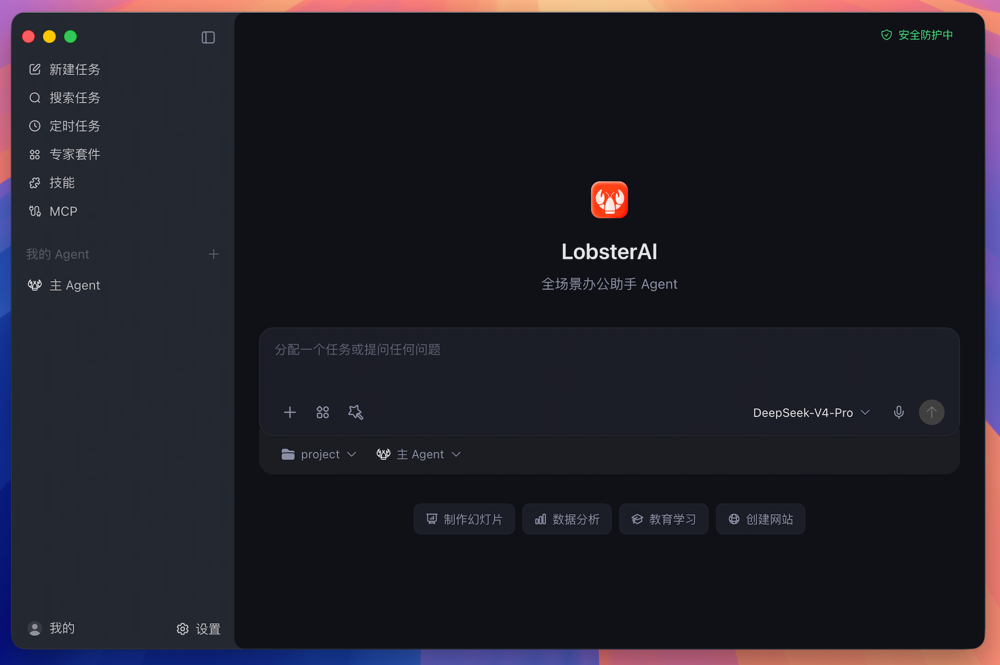

# LZClaw（海豚买买AI工作台）功能介绍

> LZClaw 是项目与研发标识，面向用户的产品名称为“海豚买买AI工作台”。

## 产品定位

海豚买买AI工作台是一款面向企业和个人办公场景的桌面 AI Agent。用户可以直接用自然语言描述目标，由 AI 在经过授权后调用本地文件、终端、浏览器、办公文档和外部工具，持续执行任务并交付可查看、可继续编辑的结果。

它不仅用于问答，还适合处理需要多个步骤、持续执行和反复迭代的实际工作，例如整理资料、分析数据、生成报告、搭建本地工具、自动检查网页以及执行周期性任务。

## 核心功能一览

| 功能模块 | 主要能力 | 典型用途 |
| --- | --- | --- |
| AI 任务工作台 | 理解目标、规划步骤、流式展示进度、保存任务历史 | 调研、分析、写作、开发和综合办公任务 |
| 本地电脑协作 | 在授权后读取和修改文件、运行终端命令、访问项目目录 | 批量整理文件、处理代码、构建本地工具 |
| 浏览器与网页操作 | 打开网页、采集信息、执行页面流程和预览本地服务 | 数据采集、后台检查、网页自动化 |
| 企业账号与模型 | 统一登录、同步可用模型、使用企业专属模型服务 | 企业成员统一使用受控的 AI 模型能力 |
| 多 Agent | 创建不同身份、模型、技能和工作目录的专属 Agent | 为运营、开发、数据、客服等角色配置助手 |
| 技能与专家套件 | 按场景组合工具、提示和参考资料 | 文档、表格、演示文稿、PDF、搜索等任务 |
| MCP 扩展 | 接入符合 Model Context Protocol 的外部服务 | 连接业务系统、数据库和第三方工具 |
| 定时任务 | 按计划自动运行任务并查看执行记录 | 日报、周报、监控、定时汇总和提醒 |
| IM 机器人 | 从常用即时通讯工具远程发起任务 | 离开电脑后继续调用桌面 Agent |
| 成果预览 | 在应用内预览代码、网页、图表、文档等结果 | 检查和交付 AI 生成的工作成果 |
| 本地记忆 | 保存会话、偏好、Agent 设置和长期工作上下文 | 在后续任务中延续个人习惯和项目背景 |

## 1. AI 任务工作台

用户可以像给同事布置工作一样描述任务。工作台会展示任务执行过程、工具调用、阶段结果和最终输出，并保留会话历史，方便继续追问、调整要求或在原任务基础上推进。

主要能力包括：

- 支持长流程、多步骤任务，不局限于单轮问答。
- 实时展示执行进度、思考状态和工具结果。
- 保存会话与消息历史，可继续未完成的工作。
- 对文件、终端、网络等敏感操作执行权限确认。
- 支持切换工作目录，让任务围绕指定项目或资料文件夹执行。

## 2. 本地文件、终端与浏览器协作

海豚买买AI工作台能够在用户授权范围内进入真实工作环境：

- 读取、创建、修改和整理本地文件。
- 执行终端命令、构建项目、运行脚本和诊断问题。
- 打开网页、执行浏览器流程并采集公开信息。
- 启动本地服务，并在应用内预览运行结果。
- 处理 Word、Excel、PowerPoint、PDF、Markdown 等常见办公资料。

涉及本地数据或系统操作时，用户仍保留最终控制权。

## 3. 企业登录、业务中心与模型服务

应用通过企业登录页完成身份认证。登录成功后自动进入任务工作台，并可在侧边栏打开业务中心处理企业相关功能。

- 登录状态使用独立的持久化网页会话，应用重启后可恢复有效会话。
- 业务中心以内嵌页面运行，切换菜单时保留滚动位置、表单和页面状态。
- 可用模型由企业平台统一发布和同步，客户端不直接暴露超级网关内部配置。
- 企业专属模型凭据只由 Electron 主进程安全接收和保存，不进入页面状态、日志或普通配置文件。
- 退出登录、切换企业或会话失效时会清理对应的企业模型凭据。

## 4. 多 Agent 协作

除了默认主 Agent，用户还可以创建面向不同岗位或任务的专属 Agent。每个 Agent 可以独立配置：

- 名称、头像、身份说明和系统提示。
- 默认模型与启用状态。
- 专属技能和专家套件。
- 默认工作目录。
- IM 机器人绑定关系。

例如，可以分别创建“数据分析助手”“研发助手”“内容运营助手”和“项目周报助手”，减少每次重复说明工作背景的成本。

## 5. 技能、专家套件与 MCP

技能为 Agent 提供面向具体工作的操作方法和工具能力，覆盖网页搜索、文档、电子表格、演示文稿、PDF、浏览器自动化、内容写作等常见场景。

专家套件可以把一组技能、参考资料和工作方式组合成可复用方案。MCP 则用于连接外部工具和数据源，使 Agent 能在统一任务流程中调用企业系统或第三方服务。

用户可以在应用内查看、启用和管理技能及 MCP 服务；启用后的配置会同步给 OpenClaw 运行时。

## 6. 定时任务

对于重复性工作，可以通过对话或定时任务页面设置自动执行计划，包括：

- 每日资讯或业务数据汇总。
- 定时检查网站、接口或后台状态。
- 自动生成日报、周报和阶段总结。
- 在指定时间执行固定工作流程。

应用提供任务列表、运行状态、执行记录和模板，便于后续维护。

## 7. IM 机器人远程使用

中文产品当前支持配置以下 IM 渠道：

- 微信
- 钉钉
- 飞书
- 企业微信
- QQ

配置后，用户可以通过聊天消息远程发起任务。不同渠道或账号还可以绑定到不同 Agent，使远程入口与具体业务角色对应。

## 8. 成果与文件预览

Agent 生成的成果可以直接在应用内查看。当前支持的成果类型包括：

- HTML 页面和本地 Web 服务
- SVG、图片和视频
- Mermaid 图表
- 代码、Markdown 和纯文本
- 文档类文件
- 本地文件目录

这使用户可以在一个窗口内完成“提出要求—执行任务—查看成果—继续修改”的完整流程。

## 9. 本地数据与长期记忆

任务会话、消息、Agent 设置和应用配置主要保存在本机 SQLite 数据库中。OpenClaw 工作区还可以通过记忆文件保存长期偏好、用户背景、Agent 身份和每日工作记录。

长期记忆适合保存稳定信息，例如常用输出格式、项目背景、工作习惯和角色偏好。敏感数据是否写入长期记忆仍应由用户明确控制。

## 10. 更新、安全与可控性

- Windows 和 macOS 客户端通过企业中台检查新版本。
- 安装包下载会校验平台、文件类型、大小和 SHA-256 摘要。
- Electron 页面启用上下文隔离和沙箱，关闭页面直接访问 Node.js 的能力。
- 页面与主进程之间通过受控 IPC 接口通信。
- 外部网页默认使用系统浏览器打开，非预期协议会被阻止。
- 文件、终端和网络等敏感操作由权限机制控制。

## 典型应用场景

| 场景 | 示例任务 |
| --- | --- |
| 数据分析 | “分析这个销售表，找出增长来源和异常，并生成一份可视化报告。” |
| 文档处理 | “整理此文件夹中的合同，提取关键日期、金额和风险条款。” |
| 演示文稿 | “调研 AI Agent 市场，将结论整理成一份汇报 PPT。” |
| 本地工具 | “根据库存表搭建一个可在浏览器打开的本地库存管理工具。” |
| 研发协作 | “检查这个项目的报错，定位原因，修复后运行相关测试。” |
| 网页自动化 | “每天检查运营后台的消耗和转化异常，并给出原因摘要。” |
| 周期性工作 | “每周五汇总本周项目进展、风险和下周计划。” |
| 远程办公 | “通过企业微信让数据分析 Agent 生成今天的经营摘要。” |

## 基本使用流程

1. 启动应用并完成企业账号登录。
2. 新建任务，选择合适的 Agent、模型和工作目录。
3. 用自然语言说明目标、输入资料和交付要求。
4. 根据提示批准必要的文件、终端或网络操作。
5. 在任务页面查看进度和成果，并继续提出修改要求。
6. 对重复性工作配置定时任务或 IM 机器人入口。

## 运行环境说明

- 主要桌面平台：Windows、macOS。
- Agent 执行引擎：OpenClaw。
- 桌面技术栈：Electron、React、TypeScript。
- 实际可用模型、技能、MCP 和企业功能取决于当前版本、账号权限及管理员配置。

