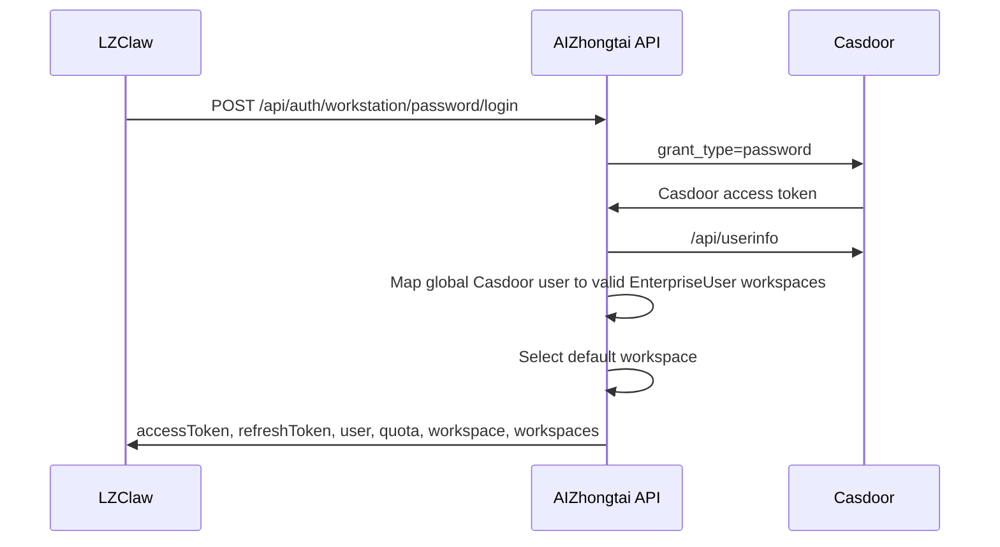
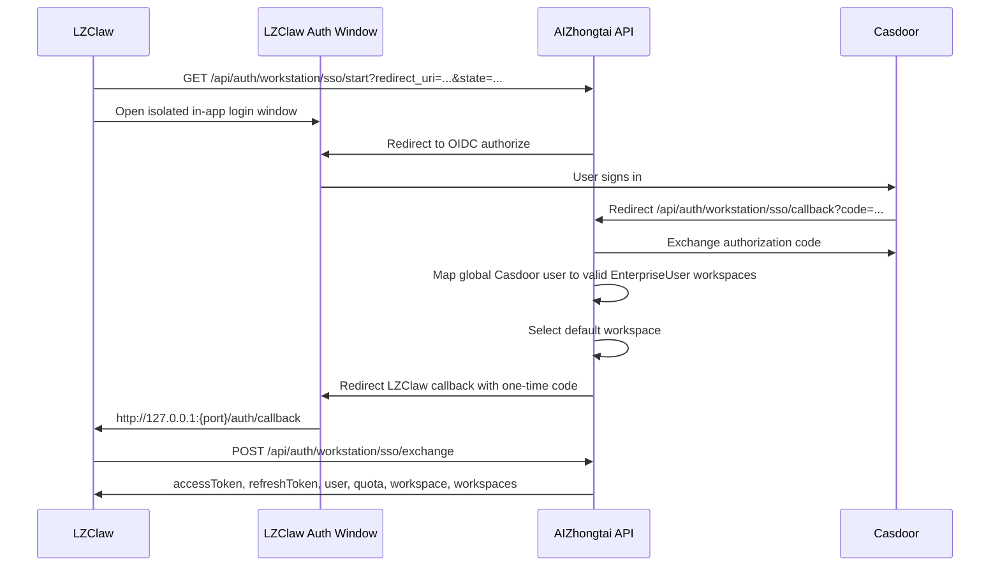

# LZClaw 接入 AIZhongtai/Casdoor 登录

## 职责边界

- Casdoor 是全局身份提供方，负责用户身份、密码校验和可选 SSO/MFA。
- AIZhongtai API 是业务会话提供方，负责企业状态、员工状态、默认工作区、Token 余额、模型授权和工作站 JWT。
- LZClaw 不保存 Casdoor token，只把 AIZhongtai 返回的工作站 `accessToken` 和 `refreshToken` 保存到现有 `auth_tokens` kv。
- 登录前不选择企业；多企业用户登录成功后在 LZClaw 个人中心切换工作区。
- LZClaw 默认使用账号密码直登，不打开 Casdoor 页面；SSO 保留为备用能力。

## 本地联调地址

- Casdoor: `http://127.0.0.1:8999`
- AIZhongtai API: `http://127.0.0.1:8081`
- LZClaw 本地 API 指向:

```powershell
npm run electron:dev:openclaw
```

开发模式没有企业 manifest、环境变量或本地 app config 覆盖时，默认使用 `http://127.0.0.1:8081`。

Server API base URL 优先级:

1. 企业 manifest `auth.apiBaseUrl`
2. `LZCLAW_SERVER_API_BASE_URL`
3. 本地 `app_config.auth.apiBaseUrl` 或旧字段 `app_config.app.serverApiBaseUrl`
4. 开发模式本地默认值 `http://127.0.0.1:8081`
5. 内置 LobsterAI 兜底地址

这个顺序保证正式企业包可由 manifest 配置 API 地址，同时本地联调默认走本机 AIZhongtai API，不受历史 app config 影响。

## 账号密码直登流程



账号密码登录要求 Casdoor Application 开启 `Password Credentials Grant`。账号密码只提交到 AIZhongtai API，由 API 调 Casdoor token endpoint 完成密码校验；Casdoor token 不返回给 LZClaw。

## SSO 备用流程



LZClaw 会优先启动本地 callback server，并在隔离的 Electron 登录窗口中打开 SSO 页面。登录窗口禁用 Node、开启 context isolation/sandbox，只允许 AIZhongtai、Casdoor 重定向链路和本地 callback 导航。如果内部登录窗口或本地 callback 准备失败，再回退到 `lobsterai://auth/callback` + 系统浏览器。当前版本继续保留 `lobsterai://` 协议，避免把协议重命名和 SSO 接入混在同一次改动里。

## LZClaw 使用的工作站接口

- `POST /api/auth/workstation/password/login`
- `POST /api/auth/workstation/sso/exchange`
- `GET /api/workstation/me`
- `GET /api/workstation/workspaces`
- `GET /api/workstation/quota`
- `POST /api/auth/workstation/switch-workspace`
- `POST /api/auth/workstation/refresh`
- `POST /api/auth/workstation/logout`
- `GET /api/workstation/models/available`

如果带工作站 token 的请求返回 `401`，LZClaw 会 refresh 一次并重试。若 refresh 被服务端明确拒绝，LZClaw 会清理本地 auth token、用户态、server model 元数据，重新同步 OpenClaw 配置，并让 renderer 回到登录态。

## 工作区切换

- LZClaw 登录页显示账号密码表单，不增加企业选择。
- `auth:passwordLogin`、`auth:exchange` 和 `auth:getUser` 会保存 `workspace/workspaces` 到 Redux 登录态。
- 当前工作区显示在个人中心。
- 当 `workspaces.length > 1` 时，个人中心显示工作区下拉切换。
- 切换工作区会调用 `POST /api/auth/workstation/switch-workspace`，保存新的工作站 token，刷新用户、额度、模型列表，并触发现有 OpenClaw server model 配置同步。

## 手工验收

1. 启动 Casdoor: `http://127.0.0.1:8999`。
2. 启动 AIZhongtai API: `http://127.0.0.1:8081`。
3. 确认 Casdoor Application 已开启 `Password Credentials Grant`。
4. 确认 Casdoor 用户位于全局组织 `aizhongtai-users`，并映射到启用状态的 AIZhongtai 企业员工。
5. 使用 `LZCLAW_SERVER_API_BASE_URL=http://127.0.0.1:8081` 启动 LZClaw。
6. 在 LZClaw 登录页输入账号密码登录。
7. 确认 LZClaw 进入工作台，并能通过 `/api/workstation/me` 在重启后恢复登录态。
8. 确认能看到当前企业工作区、企业 Token 余额和可用模型。
9. 若该 Casdoor 用户属于多个企业，确认可在个人中心切换工作区。
10. 禁用其中一个企业或员工后，确认用户仍可登录其他有效工作区；全部禁用后登录返回无可用工作区。
